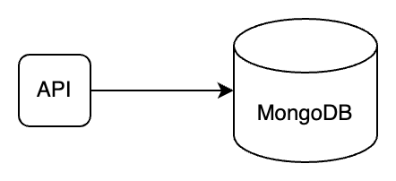

# Базовая MongoDB и API

В данной папке разворачивается MongoDB без шардирования и репликации, и API без кэширования.



## Запуск

```shell
docker compose -f docker/compose.yaml --profile api up -d
```

Поднимется MongoDB и API. При желании можно поднять MongoDB Express:

```shell
docker compose -f docker/compose.yaml --profile api --profile mongo-express up -d
```

При создании контейнера с MongoDB, в коллекции `users` появится 1000 пользователей.

Интерактивная документация API будет доступна на http://localhost:8080/docs.
