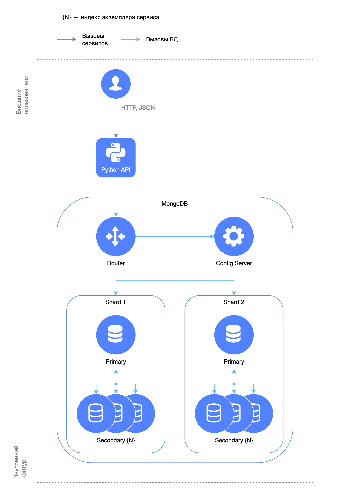

# MongoDB с шардированием

В данной папке развертывается MongoDB с шардированием и репликами, и API без кэширования.



## Запуск

Все сервисы разделены на профили, чтобы можно было запускать и тестировать их по отдельности.

Без реплик:

```shell
docker compose --profile api --profile mongodb up -d
```

С репликами:

```shell
docker compose up --profile api --profile mongodb -d --scale mongodb-shard-1=3 --scale mongodb-shard-2=3
```

Поднимется MongoDB и API. При желании можно поднять MongoDB Express:

```shell
docker compose --profile api --profile mongo-express up -d
```

Чтобы не перечислять все профили, можно указать `--profile "*"`.

При создании контейнера с MongoDB в коллекции `users` появится 1000 пользователей, равномерно распределенных по шардам.

Интерактивная документация API будет доступна на http://localhost:8080/docs.

## Остановка

```shell
docker compose --profile "*" down --remove-orphans --volumes
```
