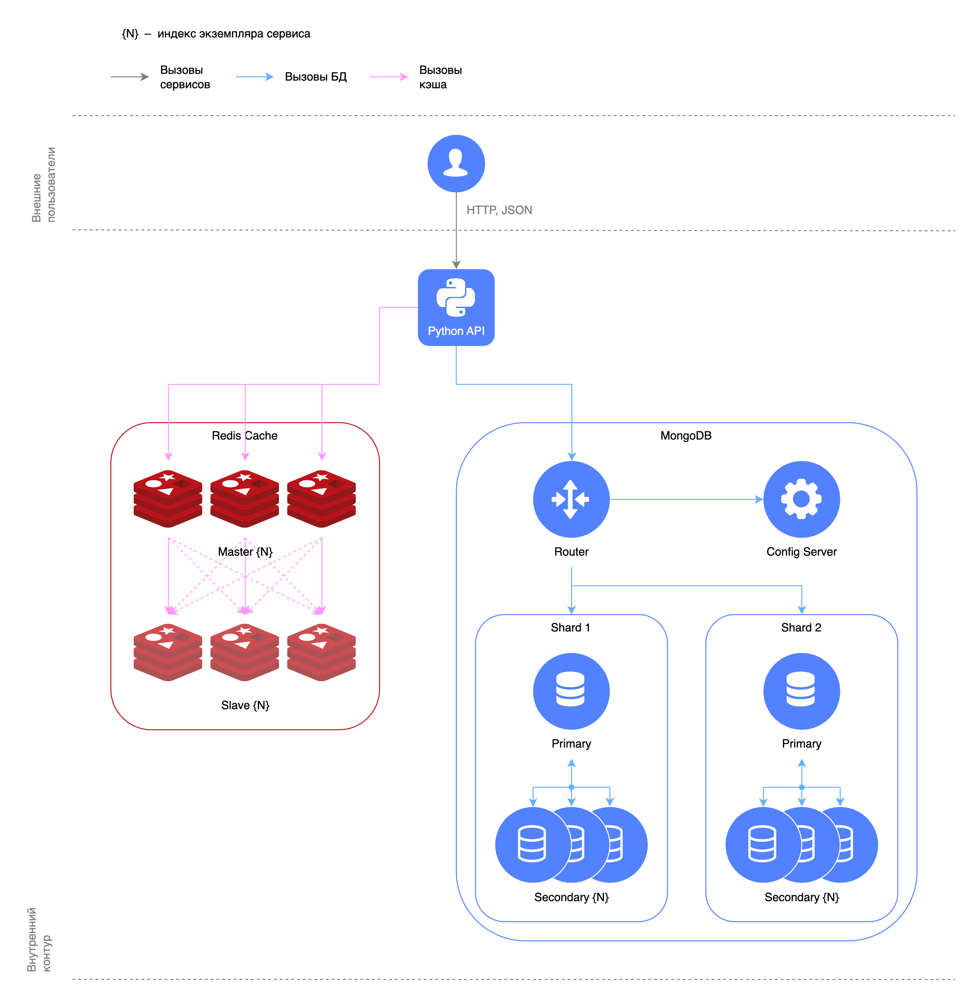

# Кэширование запросов в Redis

В данной папке развертывается API с кэшированием запросов в Redis, MongoDB с шардированием и репликами.



## Запуск

Все сервисы разделены на профили, чтобы можно было запускать и тестировать их по отдельности.

### Одиночный Redis

```shell
docker compose --profile api --profile mongodb --profile redis up -d
```

Поднимется MongoDB, API и 1 экземпляр Redis.

При желании можно поднять MongoDB Express и Redis Insight:

```shell
docker compose --profile api --profile redis --profile mongo-express --profile redis-insight up -d
```

Чтобы не перечислять все профили, можно указать `--profile "*"`.

При создании контейнера с MongoDB в коллекции `users` появится 1000 пользователей, равномерно распределенных по шардам.

Интерактивная документация API будет доступна на http://localhost:8080/docs.

Проверить работу кэширования можно замерив скорость выполнения запроса `/{collection_name}/users` первый и последующие
разы.

### Кластер Redis

Можно поднять кластер Redis. Для этого нужно обновить переменные окружения `REDIS__URL` и `REDIS__IS_CLUSTER` в сервисе
[`api`](docker/api.override.yaml). После чего запустить сервисы с профилем `redis-cluster`:

```shell
docker compose --profile api --profile mongodb --profile redis-cluster up -d
```

Изменить количество нод в кластере можно через аргумент `--scale`:

```shell
docker compose --profile api --profile mongodb --profile redis-cluster up -d --scale redis-cluster=8
```

## Остановка

```shell
docker compose --profile "*" down --remove-orphans --volumes
```
