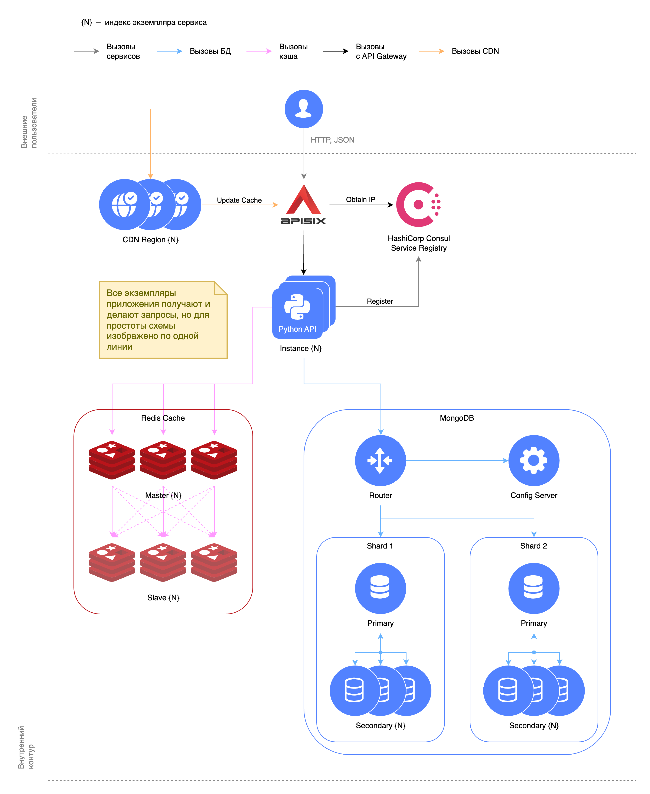

# Маршрутизация через Apache APISIX

В данной папке разворачивается MongoDB с шардированием и репликацией, API с кэшированием запросов в Redis и
маршрутизацией через Apache APISIX.



## Запуск

```shell
docker compose --profile api --profile redis up -d
```

Поднимется MongoDB, 2 экземпляра API, Redis, APISIX и сервисы, необходимые для его работы.

При желании можно поднять MongoDB Express, Redis Insight, Grafana, APISIX Dashboard:

```shell
docker compose --profile api --profile redis --profile mongo-express --profile redis-insight ... up -d
```

Чтобы не перечислять все профили, можно указать `--profile "*"`.

Масштабировать количество экземпляров API можно параметром `--scale`:

```shell
docker compose --profile api --profile redis up -d --scale api=3
```

Каждый экземпляр при запуске сам регистрируется в реестре HashiCorp Consul. Посмотреть зарегистрированные сервисы и их
состояние можно в UI Consul по адресу http://localhost:8500.

При создании контейнера с MongoDB в коллекции `users` появится 1000 пользователей, равномерно распределенных по шардам.

Интерактивная документация API будет доступна на http://localhost:9080/mongodb-api/docs.

## Остановка

```shell
docker compose --profile "*" down --remove-orphans --volumes
```
