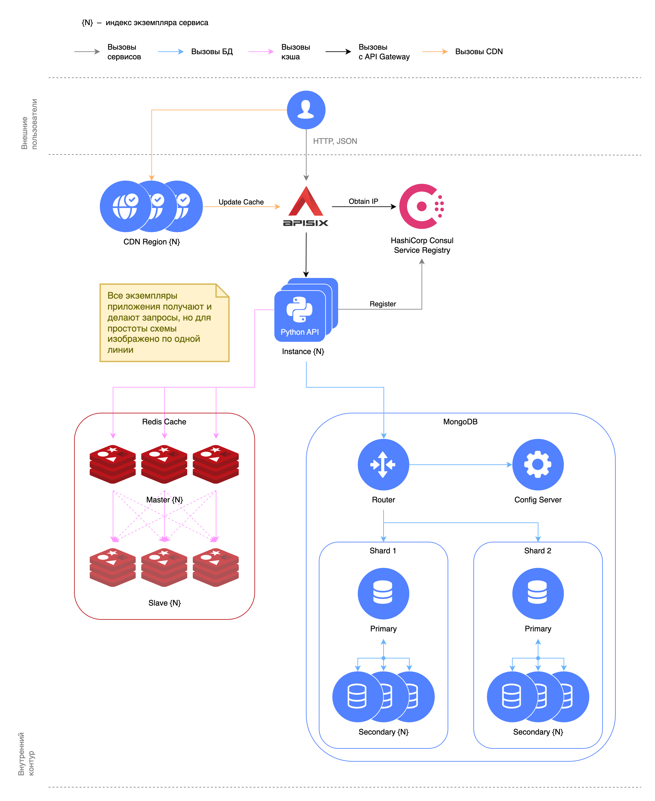

# Sharding, Replication, Caching, and Routing

This project implements MongoDB sharding and replication, API request caching in Redis, and routing via Apache APISIX.

The following folders deploy:

- [1-base](1-base) – MongoDB without sharding and replication, API without caching.

- [2-sharding-repl](2-sharding-repl) – MongoDB with sharding and replicas (or without), API without caching.

- [3-sharding-repl-cache](3-sharding-repl-cache) – API with Redis request caching, MongoDB with sharding and replicas.

- [4-api-gateway](4-api-gateway) – multiple API instances with routing via Apache APISIX and Redis request caching,
  MongoDB with sharding and replicas.

- [5-k8s](5-k8s) – Helm chart for the API in Kubernetes with Redis request caching, MongoDB with sharding and replicas.

> [!IMPORTANT]
> To run the project, Docker Compose version 2.24.4 or higher is required, as well as access to the Docker socket at
> `/var/run/docker.sock`.

## Diagram

